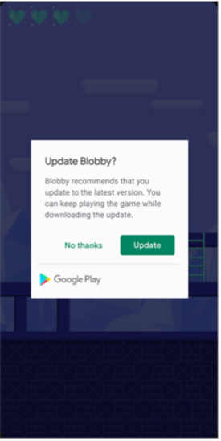
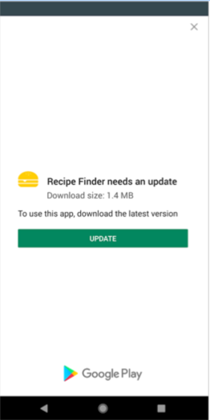
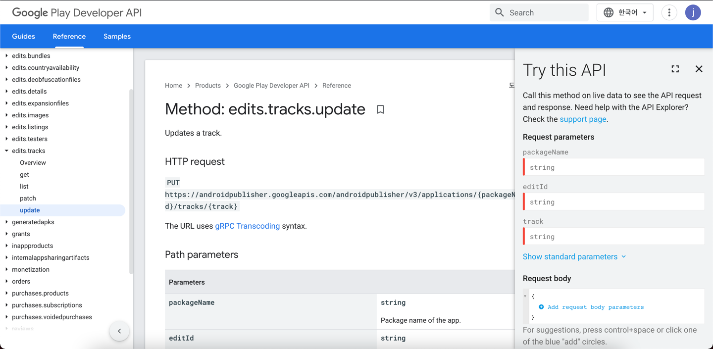
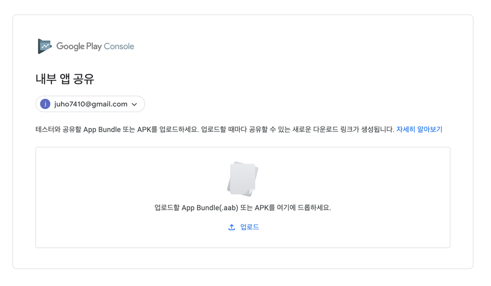

# 영어스터디 시즌 5 1주차

created by [juho](https://github.com/pachuho/Development-English-study) on 2022-01-16

https://developer.android.com/guide/playcore/in-app-updates
https://developer.android.com/guide/playcore/in-app-updates/kotlin-java

# 📗 단어 정리 📘

### OBS BUILD
|영어|한글|
|---|---|
|up to date|최신의|
|unmetered|무제한|
|rolling out|출시하다|
|specify|지정하다|

------------------------------

# In-app Updates

When your users keep your app up to date on their devices, they can try new features, as well as benefit from performance improvements and bug fixes. 

`당신의 유저들이 기기에 최신 앱을 유지할 때 성능 향상과 버그 수정의 이점뿐만 아니라 새로운 기능을 사용할 수 있습니다.`

Although some users enable background updates when their device is connected to an unmetered connection, other users might need to be reminded to install updates.

`하지만 몇몇 유저들은 무제한 연결이 될 때 백그라운드 업데이트가 가능한 유저가 있고 설치 업데이트 알림을 필요로하는 유저들도 있습니다.`

In-app updates is a Play Core library feature that prompts active users to update your app.

`인앱 업데이트는 앱 업데이트를 사용자에게 메세지를 보여주는 플레이 코어 라이브러리입니다.`

The in-app updates feature is supported on devices running Android 5.0 (API level 21) or higher, and requires your app to use Play Core library version 1.5.0 or higher. 

`인앱 업데이트는 api 21 이상에서 지원되며 플레이스토어 버전 1.5.0 이상을 요구합니다.`

Additionally, in-app updates are only supported for Android mobile devices, Android tablets, and Chrome OS devices.

`추가로 인앱 업데이트는 오직 안드로이드 디바이스, 테블릿 그리고 크롬 os 디바이스에서만 지원됩니다.`

# Update flows

Your app can use the Play Core library to support the following UX flows for in-app updates:

`인앱 업데이트는 다음과 같은 UX 플로우를 지원합니다.`

### Flexible updates



Flexible updates provide background download and installation with graceful state monitoring. 

`유연한 업데이트는 훌륭한 상태 모니터링과 함께 백그라운드 다운로드와 설치를 지원합니다.`

This UX flow is appropriate when it's acceptable for the user to use the app while downloading the update. 

`이 UX플로우는 사용자가 업데이트를 하는동안 유저가 앱을 사용할 때 적합합니다.`

For example, you might want to encourage users to try a new feature that's not critical to the core functionality of your app.

`예를들어, 당신이 유저에게 당신의 앱이 핵심 기능적으로 치명적이지 않은 새로운 업데이트를 권장할 때 사용합니다.`

### Immediate updates



Immediate updates are fullscreen UX flows that require the user to update and restart the app in order to continue using it. 

`즉시 업데이트는 전체화면 UX플로우로 앱을 사용하기위해 사용자에게 앱을 업데이트하고 재시작하는 것을 요구합니다.`

This UX flow is best for cases where an update is critical to the core functionality of your app.

`이 UX플로우는 당신의 앱이 핵심 기능적으로 치명적인 업데이트가 필요할 때 최선입니다.`

After a user accepts an immediate update, Google Play handles the update installation and app restart.

`즉시 업데이트를 수락하면 구글 플레이는 업데이트와 재시작을 처리합니다.`

### Check for update availability

Before requesting an update, check if there is an update available for your app. Use AppUpdateManager to check for an update:

`업데이트를 요구하기전에 앱 업데이트가 가능한지 체크합니다. 업데이트를 체크하기위해 AppUpdateManager를 사용합니다.`

```
val appUpdateManager = AppUpdateManagerFactory.create(context)

// Returns an intent object that you use to check for an update.
val appUpdateInfoTask = appUpdateManager.appUpdateInfo

// Checks that the platform will allow the specified type of update.
appUpdateInfoTask.addOnSuccessListener { appUpdateInfo ->
    if (appUpdateInfo.updateAvailability() == UpdateAvailability.UPDATE_AVAILABLE
        // This example applies an immediate update. To apply a flexible update
        // instead, pass in AppUpdateType.FLEXIBLE
        && appUpdateInfo.isUpdateTypeAllowed(AppUpdateType.IMMEDIATE)
    ) {
        // Request the update.
    }
}
```

The returned AppUpdateInfo instance contains the update availability status. Depending on the status of the update, the instance also contains the following:

`리턴된 앱업데이트인포 인스턴스는 업데이트가 가능한 상태를 포함합니다. 업데이트 상테에 따라서 객체는 다음을 포함합니다.`

- If an update is available and the update is allowed, the instance also contains an intent to start the update.

`업데이트가 가능하다면 객체는 업데이트 시작을 위한 인텐트를 포함합니다.`

- If an in-app update is already in progress, the instance also reports the status of the in-progress update.

`인앱 업데이트가 이미 진행중이라면 객체는 업데이트 과정의 상태를 보고합니다.`

### Check update priority

The Google Play Developer API allows you to set the priority of each update. This allows your app to decide how strongly to recommend an update to the user. 

`구글 플레이 개발자 api는 당신이 각각의 업데이트의 우선순위를 설정하는걸 가능하게합니다. 이 허용은 유저에게 업데이트를 권장하는 강도를 결정합니다.`

For example, consider the following strategy for setting update priority:

`예를들어 다음과 같이 우선순위를 세팅하면`

- Minor UI improvements: Low-priority update; request neither a flexible update nor an immediate update. Update only when the user isn't interacting with your app.

`하위 UI 향상 : 낮은 우선수위 업데이트; 유연한 업데이트나 즉각적인 업데이트를 요구합니다. 유저앱과 상호작용하지 않을때만 업데이트합니다.`

- Performance improvements: Medium-priority update; request a flexible update.

`향상된 성능: 중간 순위 업데이트; 유연한 업데이트를 요구합니다.`

- Critical security update: High-priority update; request an immediate update.

`치명적인 보안 업데이트: 높은 업데이트; 즉각 업데이트를 요구합니다.`

To determine priority, Google Play uses an integer value between 0 and 5, with 0 being the default and 5 being the highest priority. 

`우선순위를 결정하기위해 구글 플레이는 숫자 0부터 5까지를 사용합니다. 0이 기본이며 5는 높은 우선순위입니다.`

To set the priority for an update, use the inAppUpdatePriority field under Edits.tracks.releases in the Google Play Developer API. 

`업데이트 우선순위를 설정하기 위해서 Edits필드에 inAppUpdatePriority를 사용합니다. oogle Play Developer API에 있습니다.`

All newly-added versions in the release are considered to be the same priority as the release. 

`모든 새로운 버전은 릴리즈로써 같은 우선순위가 설정됩니다.`

Priority can only be set when rolling out a new release and cannot be changed later.

`우선순위는 새 출시를 할 때만 설정할 수 있으며 추후에 변경할 수 없습니다.`

Set the priority using the Google Play Developer API as described in the Play Developer API documentation. 

`우선순위를 설정하기 위해서는 Play Developer API 문서를 참고하세요.`

In-app update priority should be specified in the Edit.tracks resource passed in the Edit.tracks: update method. 

`인앱 업데이트는 Edit.tracks update method에서 전달된 Edit.tracks에서 지정해야합니다.`



The following example demonstrates releasing an app with version code 88 and inAppUpdatePriority 5:

`다음은 버전이 88코드이고 인앱업데이트순위가  5인 예제입니다. `

```
{
  "releases": [{
      "versionCodes": ["88"],
      "inAppUpdatePriority": 5,
      "status": "completed"
  }]
}
```

In your app's code, you can check the priority level for a given update using updatePriority(). 

`앱 코드에서 updatePriority()를 사용하여 우선순위 레벨을 체크합니다.`

The returned priority takes into account the inAppUpdatePriority for all app version codes between the installed version and latest available version.

`반환된 우선순위는 설치된 버전과 사용 가능한 최신 버전 사이에 있는 모든 앱 버전 코드의 inAppUpdatePriority를 고려합니다.`

```
val appUpdateManager = AppUpdateManagerFactory.create(context)

// Returns an intent object that you use to check for an update.
val appUpdateInfoTask = appUpdateManager.appUpdateInfo

// Checks whether the platform allows the specified type of update,
// and checks the update priority.
appUpdateInfoTask.addOnSuccessListener { appUpdateInfo ->
    if (appUpdateInfo.updateAvailability() == UpdateAvailability.UPDATE_AVAILABLE
          && appUpdateInfo.updatePriority() >= 4 /* high priority */
          && appUpdateInfo.isUpdateTypeAllowed(AppUpdateType.IMMEDIATE)) {
              // Request an immediate update.
    }
}
```

### Start an update

After you confirm that an update is available, you can request an update using AppUpdateManager.startUpdateFlowForResult():

`업데이트가 가능한지 확인한 후 AppUpdateManager.startUpdateFlowForResult()를 사용하여 업데이트를 요청합니다.`

```
appUpdateManager.startUpdateFlowForResult(
    // Pass the intent that is returned by 'getAppUpdateInfo()'.
    appUpdateInfo,
    // Or 'AppUpdateType.FLEXIBLE' for flexible updates.
    AppUpdateType.IMMEDIATE,
    // The current activity making the update request.
    this,
    // Include a request code to later monitor this update request.
    MY_REQUEST_CODE)
```

Each AppUpdateInfo instance can be used to start an update only once. 

`각각의 AppUpdateInfo 인스턴스는 한번만 시작될 수 있습니다.`

To retry the update in case of failure, request a new AppUpdateInfo and check again that the update is available and allowed.

`업데아트를 실패한 경우 새로운 AppUpdateInfo를 요청하고 업데이트 가능 및 허용을 확인합니다.`

The next steps depend on whether you are requesting a flexible update or an immediate update.

`그 다음 단계는 유연 업데이트와 즉각 업데이트를 요구하는지에 따라 다릅니다.`

### Get a callback for update status

After starting an update, you can use an onActivityResult() callback to handle an update failure or cancellation:

`업데이트를 시작하기위해 onActivityResult() 콜백을 사용합니다. `

```
override fun onActivityResult(requestCode: Int, resultCode: Int, data: Intent?) {
    if (requestCode == MY_REQUEST_CODE) {
        if (resultCode != RESULT_OK) {
            Log.e("MY_APP", "Update flow failed! Result code: $resultCode")
            // If the update is cancelled or fails,
            // you can request to start the update again.
        }
    }
}
```

