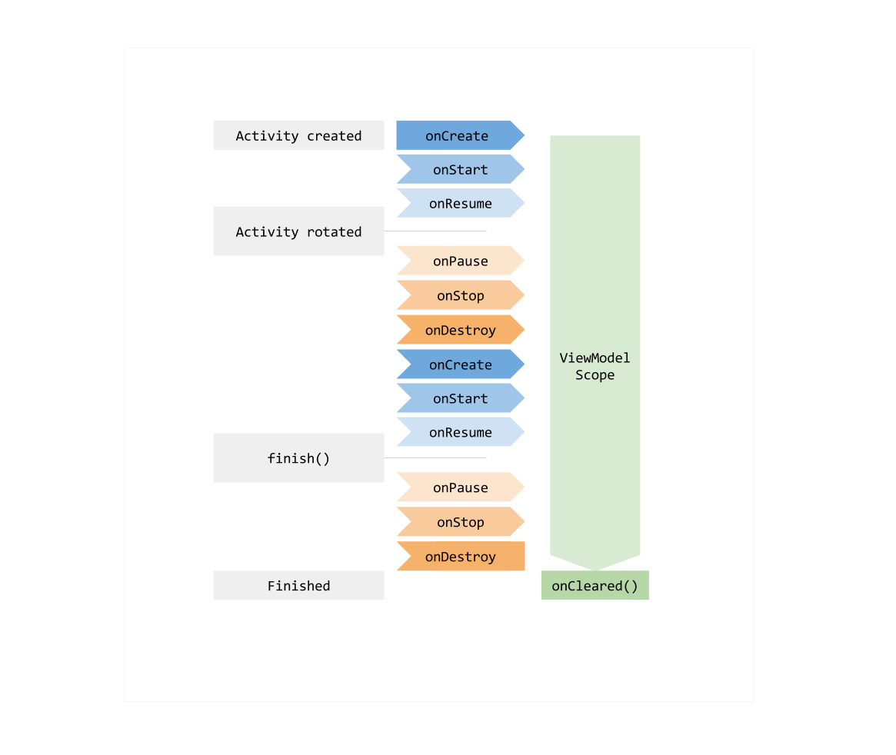
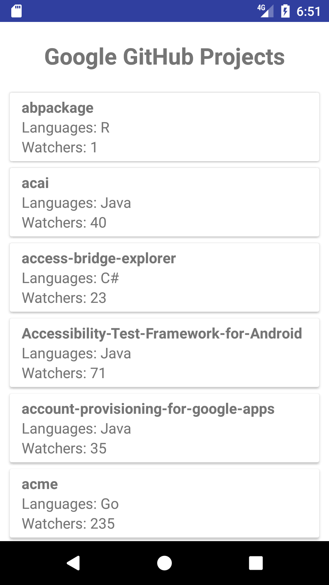
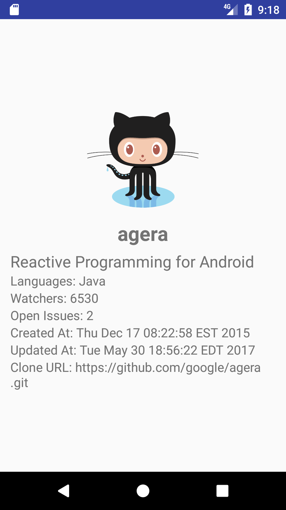
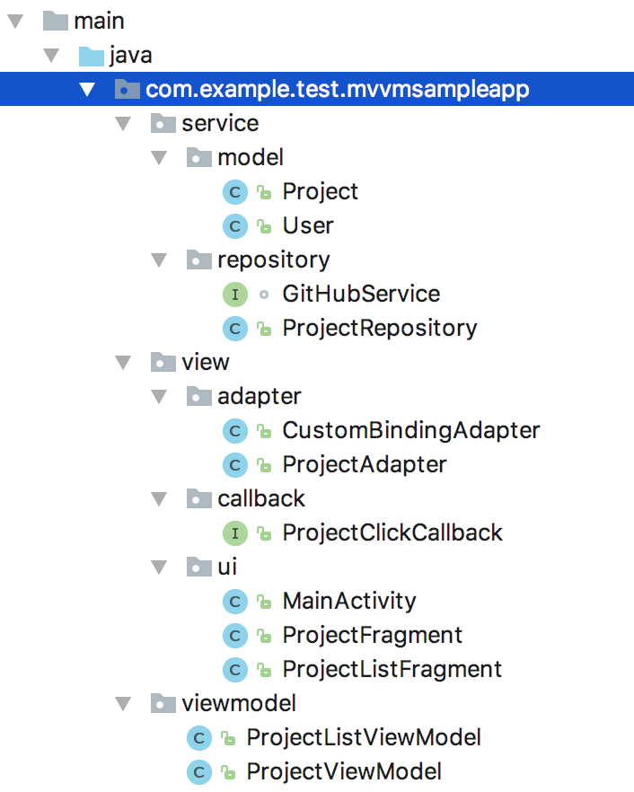
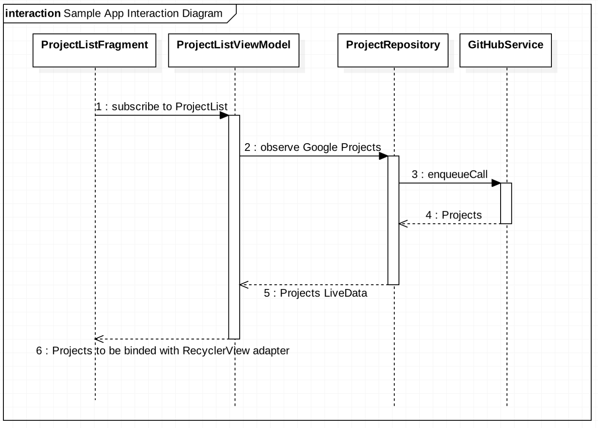

# 영어스터디 시즌 6주차

[document link](https://proandroiddev.com/mvvm-architecture-viewmodel-and-livedata-part-1-604f50cda1)

# 📗 단어 정리 📘

|영어|한글|
|----|----|
|rigid|엄격한|
|explicit|명백한|
|completely|완전히|
|benefit|혜택|
|instead|대신에|

## LiveData

`라이브 데이터`

As said above, LiveData is one of the newly introduced architecture components.   
`위에서 말했듯이, 라이브데이터는 새로 도입된 아키텍처 컴포넌트 중의 하나 입니다.`

LiveData is an observable data holder.   
`라이브데이터는 관찰하는 데이터 홀더 입니다.`

This allows the components in your app to be able to observe LiveData objects for changes without
creating explicit and rigid dependency paths between them.   
`이렇게 하면 앱의 컴포넌트가 LiveData 객체 간의 명시적이고 엄격한 종속성 경로를 만들지 않고도 변경사항을 관찰 할 수 있습니다.`

- 해석이 어려움..

This decouples completely the LiveData object producer from the LiveData object consumer.   
`이것은 라이브데이터 객체 생산자와 라이브데이터 객체 소비자가 완전히 결합하지 않습니다.`

Adding to this, there is also a great benefit in LiveData, LiveData respects the lifecycle state of
your app components (activities, fragments, services)
and handles object life cycle management which ensures that LiveData objects do not leak.   
`추가로, 이것은 또한 라이브데이터의 좋은 혜택 이며, 라이브데이터는 앱의 컴포넌트의 라이브사이클 상태를 존중하고 라이브데이터 객체가 누수가 없도록 객체의 라이프 사이클 관리해서 처리합니다.`

As per Google Docs,   
`구글 문서에 따라,`

If you are already using a library like Rx or Agera, you can continue using them instead of
LiveData.  
`만약 RX나 Agera 같은 라이브데이터를 항상 사용중이면, 라이브데이터를 대신해서 여전히 사용할 수 있습니다.`

But in this case, it is your responsibility to handle object allocation and de-allocation per
Android components life cycle.   
`하지만 이런 케이스는 안드로이드 컴포넌트 라이프사이클에 따라 객체의 할당 혹은 비할당 처리를 당신이 해야할 책임이 생깁니다. `

Since LiveData respects Android Lifecycle, this means it will not invoke its observer callback
unless the LiveData host (activity or fragment)
is in an active state (received onStart() but did not receive onStop() for example).   
`때문에 라이브데이트는 안드로이드 라이프사이클을 존중하고, 이 의미는 LiveData 호스트가 활성상태가 아니면 (onStart는 수신했지만 onStop은 수신 하지 않을 경우) 옵저버 콜백은 호출하지 않습니다.`

Adding to this,   
`추가로 `

LiveData will also automatically remove the observer when the its host receives onDestroy().   
`라이브데이터는 호스트가 onDestroy()를 수신하였을 때 자동으로 옵저버는 제거 될 것 입니다.`

LiveData will be illustrated in our MVVM sample app below.   
`라이브 데이터는 아래 앱 MVVM 샘플에 설명 되어 있습니다. `

## ViewModel

`뷰모델`

ViewModel is also one of the newly introduced architecture components.   
`뷰모델 또한 아키텍처 구성요소중의 도입된 것중 하나 입니다.`

Architecture components provide a new class called ViewModel, which is responsible for preparing the
data for the UI/View.   
`아키텍쳐 컴포넌트는 UI/VIEW의 데이터를 준비하는 책임을 가진 새로운 클래스 뷰모델을 제공합니다.`

ViewModel gives you a good base class for your MVVM ViewModel layer since ViewModel
(and its children AndroidViewModel)’s extending classes are automatically having their holding data
retained during configuration changes.   
`ViewModel(및 그 자식 AndroidViewModel)의 확장 클래스는 구성 변경 중에 보유 데이터가 자동으로 유지되기 때문에 ViewModel은 MVVM ViewModel 레이어에 대한 좋은 기본 클래스를 제공합니다.`

This means that after configuration changes, this ViewModel holded data is immediately available to
the next activity or fragment instance.   
`구성 변경 후에 뷰모델이 홀드한 데이터는 다음 액티비티 혹은 프레그먼트 인스턴스에서 즉시 사용할 수 있음을 의미합니다.`

The following diagram shows the life cycle of ViewModel component.   
`다음 다이얼그램은 뷰모델 컴포넌트의 라이프사이클을 보여줍니다.`



## Sample App

`샘플 앱`

Now, let’s come the most interesting part, let’s put all of these things together in a sample
app.   
`이제, 가장 흥미로운 부분으로 가봅시다, 이 모든것들을 샘플앱에 넣어서 함께 해보겠습니다.`

This MVVM Sample app contains mainly two screens.   
`이것은 MVVM 샘플 앱에 포함된 주요 두개의 화면 입니다. `

The first screen which is shown below displays the list of Google GitHub projects with some brief
information such as title, programming language, and finally number of watcher.   
`아래에 표시된 첫 번째 화면은 제목, 프로그래밍 언어 및 최종적으로 확인한 수와 같은 몇 가지 간단한 정보와 함께 Google GitHub 프로젝트 목록을 표시합니다.`



Once the app’s end user touch any of the list items, a details screen of the GitHub project appears
displaying project description, programming language, number of watcher, open issues, creation and
last update date, and finally the clone URL.   
`앱의 최종 사용자가 목록 항목을 터치하면 프로젝트 설명, 프로그래밍 언어, 감시자 수, 미해결 문제, 생성 및 마지막 업데이트 날짜, 마지막으로 복제 URL을 표시하는 GitHub 프로젝트의 세부 정보 화면이 나타납니다.`



## Sample App Interaction Diagram

`샘플 앱에 도입된 다이어그램 입니다.`

The following figure shows the package structure of the Sample App   
`다음 그림은 샘플 앱의 패키지 구조를 나타냅니다.`



The following interaction diagram shows a sample interaction diagram of one of the app scenarios to
retrieve Google GitHub projects.   
`다음 상호작용 다이어그램은 Google GitHub 프로젝트를 검색하기 위한 앱 시나리오 중 하나의 샘플 상호작용 다이어그램을 보여줍니다.`



As shown in the diagram, every layer observes LiveData from its subsequent layer (Fragment (View) ->
ViewModel -> Repository), and finally once project list is retrieved, it is binded with the
RecyclerView adapter to display the project list.   
`다이어그램과 같이 모든 계층은 후속 계층(Fragment(View) -> ViewModel -> Repository)에서 LiveData를 관찰하고 마지막으로 프로젝트 목록이 검색되면 RecyclerView 어댑터와 바인딩되어 프로젝트 목록을 표시합니다.`

Repository modules are responsible should handle data operations.   
`레포지토리 모듈은 데이터의 운영을 처리할 책임이 있습니다.`

By ensuring this, Repository modules can provide a clean API to the rest of the app and simplify the
job of the consumer ViewModel.    
`이를 보장함으로써 리포지토리 모듈은 앱의 나머지 부분에 깨끗한 API를 제공하고 소비자 ViewModel의 작업을 단순화할 수 있습니다.`

Repository modules should know where to get the data from and what API calls to make when data is
updated if necessary.    
`리포지토리 모듈은 데이터를 가져올 위치와 필요한 경우 데이터가 업데이트될 때 수행할 API 호출을 알아야 합니다.`

They can be considered as mediators between different data sources
(REST services, Databases, XML files, …etc).   
`서로 다른 데이터 소스 간의 중재자로 간주될 수 있습니다.`

Now, let’s explain these layers from bottom to up, starting with Model, ViewModel and finally View
for retrieving GitHub projects scenario   
`이제 Model, ViewModel 및 마지막으로 GitHub 프로젝트 검색을 위한 View 시나리오로 시작하여 이러한 계층을 아래에서 위로 설명하겠습니다.`

## Sample App Model Layer

`샘플 앱의 모델 계층`

Let’s start with the business logic layer, we have two model objects   
`비즈니스 로직 레이어부터 시작하겠습니다. 두 개의 모델 개체가 있습니다.`

1. Project, contains the information of GitHub project such as id, name, description, creation date,
   …etc.   
   `1. 프로젝트, id, 이름, 설명, 생성 날짜 등과 같은 GitHub 프로젝트 정보가 포함되어 있습니다.`

2. User, contains the user information of the GitHub project owner.   
   `사용자, GitHub 프로젝트 소유자의 사용자 정보를 포함합니다.`

In order to interact with GitHub RESTful API, I used my beloved Retrofit 2 defining the following
simple interface under repository package.   
`GitHub RESTful API와 상호 작용하기 위해 저장소 패키지 아래에 다음과 같은 간단한 인터페이스를 정의하는 내가 사랑하는 Retrofit 2를 사용했습니다.`

```
interface GitHubService {
    String HTTPS_API_GITHUB_URL = "https://api.github.com/";

    @GET("users/{user}/repos")
    Call<List<Project>> getProjectList(@Path("user") String user);

    @GET("/repos/{user}/{reponame}")
    Call<Project> getProjectDetails(@Path("user") String user, @Path("reponame") String projectName);
}
```

In order to facilitate the Job of the ViewModel, a ProjectRepository class is created to interact
with GitHub service and to finally provide a LiveData object for ViewModel.
`ViewModel의 작업을 용이하게 하기 위해 GitHub 서비스와 상호 작용하고 마지막으로 ViewModel에 대한 LiveData 개체를 제공하기 위해 ProjectRepository 클래스가 생성됩니다.`

It will be also used later to orchestrate service calls.   
`또한 나중에 서비스 호출을 조정하는 데 사용됩니다.`

The following code snippet shows getProjectList() API implementation.   
`다음 코드 조각은 getProjectList() API 구현을 보여줍니다.`

```
public class ProjectRepository {
    private GitHubService gitHubService;

    //…

    public LiveData<List<Project>> getProjectList(String userId) {
        final MutableLiveData<List<Project>> data = new MutableLiveData<>();

        gitHubService.getProjectList(userId).enqueue(new Callback<List<Project>>() {
            @Override
            public void onResponse(Call<List<Project>> call, Response<List<Project>> response) {
                data.setValue(response.body());
            }

            // Error handling will be explained in the next article …
        });

        return data;
    }
    
    // …
}
```

ProjectRepository is the data provider for ViewModel, it has getProjectList() which simply wraps the
response into LiveData Object.   
`ProjectRepository는 ViewModel의 데이터 제공자이며, 단순히 LiveData Object에 응답을 래핑하는 getProjectList()가 있습니다.`

For the purpose of simplicity of this article, error handling is omitted, and will be illustrated in
the next article.   
`이 문서의 편의를 위해 오류 처리는 생략했으며 다음 문서에서 설명합니다.`

[샘플링크](https://developer.android.com/topic/libraries/architecture/livedata.html#transformations_of_livedata)

## Sample App ViewModel Layer

`샘플 앱의 뷰모델 계층`

In order to consume getProjectList() API, a ViewModel class (that calls the Repository API and may
do any needed transformation for LiveData) is created.   
`getProjectList() API를 사용하기 위해서는, ViewModel 클래스(Repository API를 호출하고 LiveData에 필요한 변환을 수행할 수 있음)가 생성됩니다.`

The following code snippet shows ProjectListViewModel class.   
`다음 코드 조각은 ProjectListViewModel 클래스를 보여줍니다.`

```
public class ProjectListViewModel extends AndroidViewModel {
    private final LiveData<List<Project>> projectListObservable;

    public ProjectListViewModel(Application application) {
        super(application);

        // If any transformation is needed, this can be simply done by Transformations class ...
        projectListObservable = ProjectRepository.getInstance().getProjectList("Google");
    }

    /**
     * Expose the LiveData Projects query so the UI can observe it.
     */
    public LiveData<List<Project>> getProjectListObservable() {
        return projectListObservable;
    }
}
```

As shown above, our ProjectListViewModel class extends AndroidViewModel, and in the constructor, it
calls getProjectList(“Google”) to retrieve Google GitHub projects.   
`위와 같이 ProjectListViewModel 클래스는 AndroidViewModel을 확장하고 생성자에서 getProjectList("Google")를 호출하여 Google GitHub 프로젝트를 검색합니다.`

In real world cases, a transformation may be needed before passing the result data to the Observing
View, in order to make a transformation, you can use Transformation class as shown in the
documentation below:   
`실제 상황에서는 결과 데이터를 Observing View에 전달하기 전에 변환이 필요할 수 있습니다. 변환을 수행하려면 아래 문서와 같이 Transformation 클래스를 사용할 수 있습니다.`

## Sample App View Layer

`샘플 앱의 뷰 계층`

Finally, let’s give a quick look into the view layer of this app, we have mainly one Activity called
MainActivity which handles the navigation of two fragments that represent the app views:   
`마지막으로 이 앱의 뷰 레이어를 간략히 살펴보겠습니다. 주로 MainActivity라는 액티비티가 있는데 이 액티비티는 앱 뷰를 나타내는 두 개의 프래그먼트 탐색을 처리합니다.`

1. ProjectListFragment, which displays the list of Google GitHub projects.   
   `ProjectListFragment, Google GitHub 프로젝트 목록을 표시합니다.`

2. ProjectFragment, which displays the selected GitHub project details.   
   `ProjectFragment, 선택한 GitHub 프로젝트 세부 정보를 표시합니다.`

Since Activities and Fragments are considered Life cycle owners, Activities need to extend
LifecycleActivity and fragments need to extend LifecycleFragment.   
`액티비티와 프래그먼트는 라이프 사이클 소유자로 간주되므로 액티비티는 LifecycleActivity를 확장해야 하고 프래그먼트는 LifecycleFragment를 확장해야 합니다.`

However, it is important to keep in mind that both LifecycleActivity and LifecycleFragment classes
are temporary implementations until Lifecycles are integrated with support library:   
`그러나 LifecycleActivity 및 LifecycleFragment 클래스는 모두 Lifecycle이 지원 라이브러리와 통합될 때까지 임시 구현이라는 점을 명심하는 것이 중요합니다.`

Now, let’s continue our projects retrieval scenario, looking into ProjectListFragment, the following
code snippet shows the most important integration part.   
`이제 프로젝트 검색 시나리오를 계속 진행하여 ProjectListFragment를 살펴보겠습니다. 다음 코드 스니펫은 가장 중요한 통합 부분을 보여줍니다.`

```
public class ProjectListFragment extends LifecycleFragment {
    private ProjectAdapter projectAdapter;
    
    //…

    @Override
    public void onActivityCreated(@Nullable Bundle savedInstanceState) {
        super.onActivityCreated(savedInstanceState);
        final ProjectListViewModel viewModel =
                ViewModelProviders.of(this).get(ProjectListViewModel.class);

        observeViewModel(viewModel);
    }

    private void observeViewModel(ProjectListViewModel viewModel) {
        // Update the list when the data changes
        viewModel.getProjectListObservable().observe(this, new Observer<List<Project>>() {
            @Override
            public void onChanged(@Nullable List<Project> projects) {
                if (projects != null) {
                    //…
                    projectAdapter.setProjectList(projects);
                }
            }
        });
    }

    //…
}
```   

As shown above, ProjectListFragment gets ProjectListViewModel, and then listen to its
getProjectListObservable() method in order to get the list of Github projects when ready.    
`위와 같이 ProjectListFragment는 ProjectListViewModel을 가져온 다음 getProjectListObservable() 메서드를 수신하여 준비되면 Github 프로젝트 목록을 가져옵니다.`

Finally, Once the list of projects is retrieved, it is passed to projectAdapter (the RecyclerView
adapter)
in order to display the list of projects in the RecyclerView component.   
`마지막으로 프로젝트 목록이 검색되면 RecyclerView 구성 요소에 프로젝트 목록을 표시하기 위해 projectAdapter(RecyclerView 어댑터)에 전달됩니다.`

This is the explanation of one end-to-end scenario of the project, you can find the complete project
available in GitHub here:   
`이것은 프로젝트의 시나리오에 대한 설명입니다. GitHub에서 사용 가능한 전체 프로젝트는 여기에서 찾을 수 있습니다.`

[샘플링크](https://github.com/hazems/mvvm-sample-app/tree/part1)

## Important Guiding Principles for MVVM Implementation

`MVVM 구현을 위한 중요한 지침 원칙`

Now, it is important to highlight some of the important guiding principles for MVVM
implementation:   
`이제 MVVM 구현을 위한 몇 가지 중요한 지침 원칙을 강조하는 것이 중요합니다.`

1. As shown in the sample, ViewModels do not and must not reference Views directly because if this
   is done, ViewModels can outlive the View’s lifecycle and memory leakage can happen.
   `샘플에 표시된 대로 ViewModel은 View를 직접 참조하지 않으며 참조하지 않아야 합니다. 
   ViewModel은 View의 수명 주기보다 오래 지속될 수 있으며 메모리 누수가 발생할 수 있습니다.`
   
2. Model and ViewModel are recommended to expose their data using LiveData since LiveData respects
   the lifecycle state of app components (activities, fragments, services) and handles object life
   cycle management which ensures that LiveData objects do not leak.
   `LiveData는 앱 구성 요소(액티비티, 프래그먼트, 서비스)의 수명 주기 상태를 존중하고
   LiveData 개체가 누출되지 않도록 개체 수명 주기 관리를 처리하므로 Model 및 ViewModel은 LiveData를 사용하여
   데이터를 노출하는 것이 좋습니다.`
   