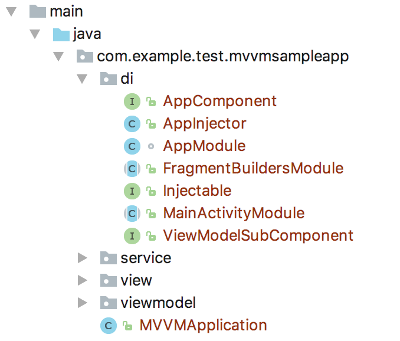

# 영어스터디 시즌 8주차

[document link](https://proandroiddev.com/mvvm-architecture-viewmodel-and-livedata-part-2-di-1a6b1f96d84b)

# 📗 단어 정리 📘

|영어|한글|
|----|----|
|raised at| ~에서 제기|
|discuss|논의 하다|
|self-explanatory|자명 하다|
|utilize |활용 하다|
|refer to|인용 하다|


# Part2   
   
During Google I/O, Google introduced architecture components which includes LiveData and ViewModel
which facilitates developing Android app using MVVM pattern.   
`Google I/O 동안 Google은 MVVM 패턴을 사용하여 Android 앱 개발을 용이하게
하는 LiveData 및 ViewModel을 포함하는 아키텍처 구성 요소를 도입했습니다.`   
   
In the first article of this series, we discussed how can these components serve an android 
app that follows MVVM.   
`이 시리즈의 첫 번째 기사에서는 이러한 구성 요소가 MVVM을 따르는 Android 앱을 제공하는 방법에 대해 논의했습니다.`   
   
In this second article, we will answer one of the questions that was raised at the end of the first
article which is Dependency injection.   
`이 두 번째 기사에서는 첫 번째 기사의 끝에서 제기된 질문 중 하나인 종속성 주입에 대한 답변을 제공합니다.`   
   
This article assumes that you have a basic knowledge of Dagger since we will focus on setting up 
the latest Dagger version (version 2.11) in our MVVM sample in order to implement Dependency injection.   
`이 문서에서는 종속성 주입을 구현하기 위해 MVVM 샘플에서 최신 Dagger 버전(버전 2.11)을 설정하는 데
중점을 둘 것이기 때문에 Dagger에 대한 기본 지식이 있다고 가정합니다.`     
   
If you need basic information about Dagger 2.11, checkout Dagger user guide.   
`Dagger 2.11에 대한 기본 정보가 필요한 경우 Dagger 사용 설명서를 확인하세요.`   
    
## Configuring Dagger 2.11   
`대거 2.11 구성`    
   
First of all, let’s add Dagger 2.11 dependencies to our MVVM Sample.   
`첫번째로 MVVM 샘플에 Dagger 2.11 종속성을 추가해 보겠습니다.`   
   
## Specify Dagger Version 2.11   
`대거 버전 2.11 지정`   
   
```
project.ext {
    // … 
    dagger_version = "2.11"
}
```   
   
## Including Dagger core   
`대거 core 포함`   
   
```
annotationProcessor "com.google.dagger:dagger-compiler:$dagger_version"
compile "com.google.dagger:dagger:$project.dagger_version"
```   
   
## Including Dagger Android   
`안드로이드 대거 포함`   
   
```
compile "com.google.dagger:dagger-android:$project.dagger_version"
compile "com.google.dagger:dagger-android-support:$project.dagger_version"

annotationProcessor "com.google.dagger:dagger-android-processor:$dagger_version"
```
   
## Dagger 2.11 Project Setup
`Dagger 2.11 프로젝트 설정`   

The following figure shows the main Dagger 2.11 setup that we have in this sample.   
`다음 그림은 이 샘플에 있는 주요 Dagger 2.11 설정을 보여줍니다.`   

    
    

We have mainly the following Dagger App classes/interfaces:   
`주로 다음과 같은 Dagger 앱 클래스/인터페이스가 있습니다.`   
   
1. AppModule is a Dagger module responsible for providing singleton services on the 
   application level such as GitHubService and ProjectViewModelFactory.   
   `1. AppModule은 GitHubService 및 ProjectViewModelFactory와 같은 애플리케이션 
   수준에서 싱글톤 서비스를 제공하는 Dagger 모듈입니다.`    
   
2. AppComponent is responsible for injecting AppModule.   
   `2. AppComponent는 AppModule 주입을 담당합니다.`   
   
3. ViewModelSubComponent is a sub component to create View Model instances.   
   `3. ViewModelSubComponent는 View Model 인스턴스를 생성하기 위한 하위 컴포넌트입니다.`   
   
4. MainActivityModule and FragmentBuildersModule are activity and fragment instances providers.   
   `4. MainActivityModule 및 FragmentBuildersModule은 활동 및 프래그먼트 인스턴스 제공자입니다.` 
   
5. Injectable is just a marker interface for fragments that will be injectable.   
    `5. Injectable은 주입 가능한 조각에 대한 마커 인터페이스일 뿐입니다.`   
   
6. AppInjector is a helper class to automatically inject fragments if they implement Injectable interface.   
   `6. AppInjector는 Injectable 인터페이스를 구현하면 자동으로 프래그먼트를 주입하는 도우미 클래스입니다.`

Now, let’s get into the details of every Dagger item in this setup.   
`이제 이 설정의 모든 Dagger 항목에 대해 자세히 알아보겠습니다.`   
   
## Creating View Model SubComponent   
`뷰 모델 하위 구성 요소 생성`   

The following code snippet shows ViewModelSubComponent interface, 
which is responsible for creating ViewModel instances.   
`다음 코드 스니펫은 ViewModel 인스턴스 생성을 담당하는 ViewModelSubComponent 인터페이스를 보여줍니다.`   
   
```
@Subcomponent
public interface ViewModelSubComponent {
    @Subcomponent.Builder
    interface Builder {
        ViewModelSubComponent build();
    }

    ProjectListViewModel projectListViewModel();
    ProjectViewModel projectViewModel();
}
```   

Note that, ViewModelSubComponent will be called by ProjectViewModelFactory for 
getting ViewModel instances.   
`참고로, ViewModelSubComponent는 ViewModel 인스턴스를 가져오기 위해 ProjectViewModelFactory에 의해 호출됩니다.`   
   
### But what is ProjectViewModelFactory?   
`그러나 ProjectViewModelFactory는 무엇입니까?`   

The next section answers this question.   
`다음 섹션에서는 이 질문에 답합니다.`   

## Creating custom View Model Factory   
`커스텀 뷰 모델 팩토리 생성`   
   
ProjectViewModelFactory is a factory that extends ViewModelProvider.Factory in
order to provide ViewModel instances to consumer fragment classes.   
`ProjectViewModelFactory는 ViewModel 인스턴스를 
소비자 프래그먼트 클래스에 제공하기 위해 ViewModelProvider.Factory를 확장하는 팩토리입니다.`   

The following code snippet shows ProjectViewModelFactory which is a self-explanatory Factory 
implementation that extends ViewModelProvider.Factory.   
`다음 코드 조각은 ViewModelProvider.Factory를 확장하는 자체 설명이 가능한 Factory 구현인
ProjectViewModelFactory를 보여줍니다.`   
   
```
@Singleton
public class ProjectViewModelFactory implements ViewModelProvider.Factory {
    private final ArrayMap<Class, Callable<? extends ViewModel>> creators;

    @Inject
    public ProjectViewModelFactory(ViewModelSubComponent viewModelSubComponent) {
        creators = new ArrayMap<>();
        
        // View models cannot be injected directly because they won't be bound to the owner's
        // view model scope.
        creators.put(ProjectViewModel.class, () -> viewModelSubComponent.projectViewModel());
        creators.put(ProjectListViewModel.class, () -> viewModelSubComponent.projectListViewModel());
    }

    @Override
    public <T extends ViewModel> T create(Class<T> modelClass) {
        Callable<? extends ViewModel> creator = creators.get(modelClass);
        if (creator == null) {
            for (Map.Entry<Class, Callable<? extends ViewModel>> entry : creators.entrySet()) {
                if (modelClass.isAssignableFrom(entry.getKey())) {
                    creator = entry.getValue();
                    break;
                }
            }
        }
        if (creator == null) {
            throw new IllegalArgumentException("Unknown model class " + modelClass);
        }
        try {
            return (T) creator.call();
        } catch (Exception e) {
            throw new RuntimeException(e);
        }
    }
}
```   

Now, let’s see the main app module in the next section.   
`이제 다음 섹션에서 주요 앱 모듈을 살펴보겠습니다.`   

## Creating App Module   
`앱 모듈 생성`   
   
AppModule is a Dagger module responsible for providing singleton services 
on the application level such as GitHubService and
ProjectViewModelFactory to consumers.    
`AppModule은 GitHubService 및 ProjectViewModelFactory와 같은 애플리케이션 수준의 싱글톤 서비스를
소비자에게 제공하는 Dagger 모듈입니다.`    
   
The following code snippet shows AppModule class   
`다음 코드 스니펫은 AppModule 클래스를 보여줍니다.`   
   
```
@Module(subcomponents = ViewModelSubComponent.class)
class AppModule {
    @Singleton @Provides
    GitHubService provideGithubService() {
        return new Retrofit.Builder()
                .baseUrl(GitHubService.HTTPS_API_GITHUB_URL)
                .addConverterFactory(GsonConverterFactory.create())
                .build()
                .create(GitHubService.class);
    }

    @Singleton
    @Provides
    ViewModelProvider.Factory provideViewModelFactory(
            ViewModelSubComponent.Builder viewModelSubComponent) {

        return new ProjectViewModelFactory(viewModelSubComponent.build());
    }
}
```   

Something important here to note, do not forget to wire
ViewModelSubComponent to AppModule by specifying it in the
subcomponents parameter of @Module annotation.   
`여기서 주목해야 할 중요한 사항은 @Module 주석의 하위 구성 요소 매개 변수에 지정하여 
ViewModelSubComponent를 AppModule에 연결하는 것을 잊지 마십시오.`   
   
Creating Injectable and AppInjector   
`Injectable 및 AppInjector 만들기`   
   
Injectable interface is just a plain empty marker interface as follows.   
`주입 가능한 인터페이스는 다음과 같이 그냥 비어 있는 일반 마커 인터페이스입니다.`   
   
```
public interface Injectable {
}
```   

Injectable will be implemented by fragments which will be injectable.   
`Injectable은 주입 가능한 조각으로 구현됩니다.`   
   
In order to automatically inject fragments if they implement Injectable interface, 
the following AppInjector helper class is created to inject fragment instance on onFragmentCreated()
as follows.   
`Injectable 인터페이스를 구현하면 자동으로 프래그먼트를 주입하기 위해
다음과 같이 onFragmentCreated()에 프래그먼트 인스턴스를 주입하기 위해 
다음 AppInjector 도우미 클래스를 생성합니다.`   
   
```
public class AppInjector {
    private AppInjector() {}

    public static void init(MVVMApplication mvvmApplication) {
        DaggerAppComponent.builder().application(mvvmApplication)
                .build().inject(mvvmApplication);

        mvvmApplication
                .registerActivityLifecycleCallbacks(new Application.ActivityLifecycleCallbacks() {
                    @Override
                    public void onActivityCreated(Activity activity, Bundle savedInstanceState) {
                        handleActivity(activity);
                    }

                    // Other methods are omitted for simplification …
                });
    }

    private static void handleActivity(Activity activity) {
        if (activity instanceof HasSupportFragmentInjector) {
            AndroidInjection.inject(activity);
        }
        if (activity instanceof FragmentActivity) {
            ((FragmentActivity) activity).getSupportFragmentManager()
                    .registerFragmentLifecycleCallbacks(
                            new FragmentManager.FragmentLifecycleCallbacks() {
                                @Override
                                public void onFragmentCreated(FragmentManager fm, Fragment fragment,
                                                              Bundle savedInstanceState) {
                                    if (fragment instanceof Injectable) {
                                        AndroidSupportInjection.inject(fragment);
                                    }
                                }
                            }, true);
        }
    }
}
```   

One thing to note, AppInjector.init() will be called in App startup 
(as what we will show in Custom Application class section).   
`한 가지 주의할 점은 AppInjector.init()가 
앱 시작 시 호출된다는 것입니다(사용자 지정 응용 프로그램 클래스 섹션에서 표시할 내용).`   

## Creating Activity and Fragment Modules   
`액티비티 및 프레그먼트 모듈 만들기`   
   
The following code snippets shows Fragments Dagger module.   
`다음 코드 조각은 Fragments Dagger 모듈을 보여줍니다.`   
   
```
@Module
public abstract class FragmentBuildersModule {
    @ContributesAndroidInjector
    abstract ProjectFragment contributeProjectFragment();

    @ContributesAndroidInjector
    abstract ProjectListFragment contributeProjectListFragment();
}
```   

Starting from Dagger 2.10, @ContributesAndroidInjector easily attaches activities and fragments
to dagger graph.   
`Dagger 2.10부터 @ContributesAndroidInjector는 액티비티와 프래그먼트를 dagger 그래프에 쉽게 첨부합니다.`   
   

The following code snippet shows MainActivityModule.   
`다음 코드 조각은 MainActivityModule을 보여줍니다.`   
   
```
@Module
public abstract class MainActivityModule {
    @ContributesAndroidInjector(modules = FragmentBuildersModule.class)
    abstract MainActivity contributeMainActivity();
}
```

Now, let’s look into the last item in our Dagger 2.11 setup, which is, AppComponent.   
`이제 Dagger 2.11 설정의 마지막 항목인 AppComponent를 살펴보겠습니다.`   

## Creating AppComponent   
`앱 컴포넌트 생성`   
   
The next code snippet shows AppComponent interface.   
`다음 코드 조각은 AppComponent 인터페이스를 보여줍니다.`   
   
```

@Singleton
@Component(modules = {
        AndroidInjectionModule.class,
        AppModule.class,
        MainActivityModule.class
})
public interface AppComponent {
    @Component.Builder
    interface Builder {
        @BindsInstance Builder application(Application application);
        AppComponent build();
    }
    void inject(MVVMApplication mvvmApplication);
}
```   
One thing important to note here, adding to including AppModule and MainActivityModule,
we added AndroidSupportInjectionModule to AppComponent as per the official documentation
that states that it is necessary in order to ensure that all necessary bindings are available.   
`여기서 주목해야 할 중요한 한 가지는 AppModule 및 MainActivityModule을 
포함하는 것 외에 필요한 모든 바인딩을 사용할 수 있도록 하기 위해 필요하다는 공식 문서에 따라
AppComponent에 AndroidSupportInjectionModule을 추가했습니다.`   
   
AndroidSupportInjectionModule is a built-in module in dagger-android:   
`AndroidSupportInjectionModule은 dagger-android에 내장된 모듈입니다.`   

[AndroidSupportInjectionModule깃허브](https://github.com/google/dagger/blob/master/java/dagger/android/support/AndroidSupportInjectionModule.java)   

## Updating Repository Layer Implementation
`리포지토리 계층 구현 업데이트`   

Now, we are done from setting up Dagger 2.11, 
let’s update our existing app code in order to utilize Dagger dependency injection.   
`이제 Dagger 2.11 설정을 마쳤습니다. Dagger 종속성 주입을 활용하기 위해 기존 앱 코드를 업데이트하겠습니다.`   
   
ProjectRepository will not have to create GitHubService service instance manually anymore,
all what it needs to do is to use @Inject in its constructor for GitHubService instance as shown below.   
`ProjectRepository는 더 이상 GitHubService 서비스 인스턴스를 수동으로 생성할 필요가 없으며 
아래 표시된 것처럼 GitHubService 인스턴스용 생성자에서 @Inject를 사용하기만 하면 됩니다.`   
   
```
@Singleton
public class ProjectRepository {
    private GitHubService gitHubService;

    @Inject
    public ProjectRepository(GitHubService gitHubService) {
        this.gitHubService = gitHubService;
    }

    // Other methods here are omitted for simplicity …
}
```   

## Updating ViewModel Layer Implementation   
`ViewModel 레이어 구현 업데이트`  

Updating ViewModel layer is also necessary to avoid creating an instance 
from ProjectRepository manually inside this layer.   
`이 레이어 내에서 수동으로 ProjectRepository에서 인스턴스를 생성하지 
않으려면 ViewModel 레이어를 업데이트해야 합니다.`   
      
The following code snippet shows an example from ProjectViewModel which uses
@inject annotation to have both Application and ProjectRepository instances injected.   
`다음 코드 조각은 @inject 주석을 사용하여 Application 및 ProjectRepository
인스턴스를 모두 주입하는 ProjectViewModel의 예를 보여줍니다.`   
   
```
public class ProjectViewModel extends AndroidViewModel {
    private static final String TAG = ProjectViewModel.class.getName();
    private static final MutableLiveData ABSENT = new MutableLiveData();
    {
        //noinspection unchecked
        ABSENT.setValue(null);
    }

    private final LiveData<Project> projectObservable;
    private final MutableLiveData<String> projectID;

    public ObservableField<Project> project = new ObservableField<>();

    @Inject
    public ProjectViewModel(@NonNull ProjectRepository projectRepository, @NonNull Application application) {
        super(application);

        this.projectID = new MutableLiveData<>();

        projectObservable = Transformations.switchMap(projectID, input -> {
            if (input.isEmpty()) {
                return ABSENT;
            }

            return projectRepository.getProjectDetails("Google", projectID.getValue());
        });
    }

    // Code is omitted for simplicity …
}
```   

Updating View Implementation (Fragments and Main Activity)   
`뷰 구현 업데이트(프래그먼트 및 기본 활동)`   
   
Updating View layer is also necessary to avoid
creating instances from ViewModel classes manually inside this layer.   
`이 계층 내에서 수동으로 ViewModel 클래스에서 인스턴스를 생성하지 않으려면 View 계층을 업데이트해야 합니다.`   
   
The following code snippet shows an example from ProjectFragment.   
`다음 코드 스니펫은 ProjectFragment의 예를 보여줍니다.`   
   
```

public class ProjectFragment extends LifecycleFragment implements Injectable {

    @Inject
    ViewModelProvider.Factory viewModelFactory;


    @Override
    public void onActivityCreated(@Nullable Bundle savedInstanceState) {
        super.onActivityCreated(savedInstanceState);

        final ProjectViewModel viewModel = ViewModelProviders.of(this, viewModelFactory)
                .get(ProjectViewModel.class);

        // …
    }

    // …
}
```   

Some important points to note here:
`여기에서 주의해야 할 몇 가지 중요한 사항:`   

1. Every fragment now must implement Injectable Interface.
   `1. 이제 모든 프레그먼트는 주입 가능한 인터페이스를 구현해야 합니다.`   
   
2. Fragment classes should refer to ViewModelProvider.Factory in order to get ViewModel instances.   
   `2. 프래그먼트 클래스는 ViewModel 인스턴스를 가져오기 위해 ViewModelProvider.Factory를 참조해야 합니다.`   

## Creating Custom Application class   
`커스텀 애플리케이션 클래스 생성`   
   
Finally, our custom application class code is shown below.   
`마지막으로 커스텀한 어플리케이션 클래스 코드가 아래에 나와 있습니다.`   
   
```
public class MVVMApplication extends Application implements HasActivityInjector {

    @Inject
    DispatchingAndroidInjector<Activity> dispatchingAndroidInjector;

    @Override
    public void onCreate() {
        super.onCreate();
        AppInjector.init(this);
    }

    @Override
    public DispatchingAndroidInjector<Activity> activityInjector() {
        return dispatchingAndroidInjector;
    }
}
```   

Two main things to note here:   
`여기서 주목해야 할 두 가지 주요 사항:`   

1. Application class has to implement HasActivityInjector, and @Inject a DispatchingAndroidInjector<Activity> to return from the activityInjector() method.   
   `1. Application 클래스는 HasActivityInjector를 구현해야 하며, @Inject a DispatchingAndroidInjector<Activity> 를 activityInjector() 메서드에서 반환해야 합니다.`

2. In the onCreate() of Application class, we initialize AppInjector in order to automatically inject fragments if they implement Injectable interface.   
`2. Application 클래스의 onCreate()에서 Injectable 인터페이스를 구현한 프래그먼트를 자동으로 주입하기 위해 AppInjector를 초기화합니다.`    
   

[전체 샘플 코드](https://github.com/hazems/mvvm-sample-app/tree/part2)