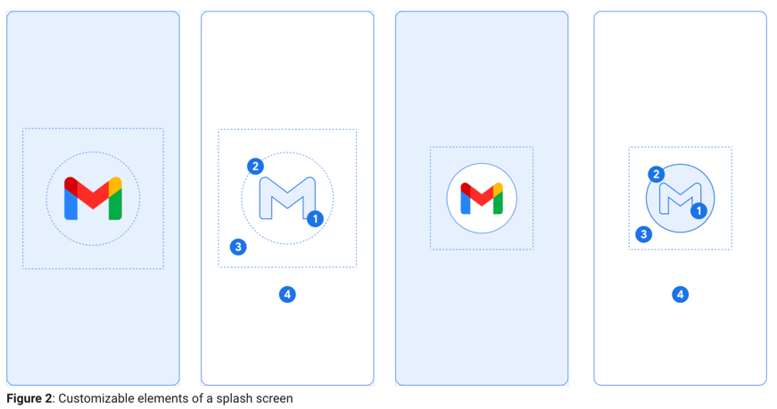
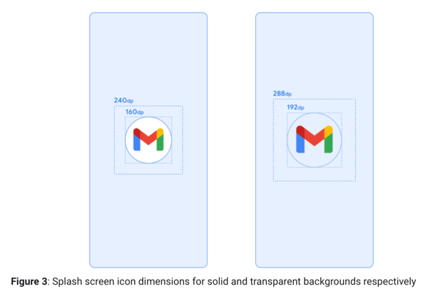

# 영어스터디 시즌 5 1주차

created by [juho](https://github.com/pachuho/Development-English-study) on 2022-02-12

[android developer - splash screen](https://developer.android.com/guide/topics/ui/splash-screen)

# 📗 단어 정리 📘

### OBS BUILD
|영어|한글|
|---|---|
|consist of|~로 구성되다|
|Be aware of| ~을 유의하다, 알아차리다, 인식하다|
|contrast|차이, 대조, 대비|
|adaptive icon|적응형 아이콘|
|opaque|불투명한|
|specifications|사양|
|diameter|지름|
------------------------------

# Splash Screen

> Important: If you have previously implemented a custom splash screen in Android 11 or lower, 
> you’ll need to migrate your app to the SplashScreen API to ensure that it displays correctly in Android 12 and higher. 
> For instructions, see Migrate your existing splash screen implementation to Android 12.

`중요: 안드로이드 11 이하에서 커스텀 스플래쉬 스크린을 사전에 구현하였다면 안드로이드 12 이상에서 적절한 스플래쉬 API를 위해서 앱을 마이그레이트 해주어야합니다. 지침에 대해서 참고 해주세요.`

Android 12 adds the SplashScreen API, which enables a new app launch animation for all apps when running on a device with Android 12 or higher. 

`스플래시 스크린이 추가된 안드로이드 12는 안드로이드 12 이상의 모든 앱에 대해 시작 애니메이션이 가능합니다.`

This includes an into-app motion at launch, a splash screen showing your app icon, and a transition to your app itself.

`이것은 시작 시 앱 모션, 앱 아이콘을 보야주는 스플래시 화면, 앱 자체의 전환이 포함됩니다.`

The new experience brings standard design elements to every app launch, but it’s also customizable so your app can maintain its unique branding.

`모든 앱의 시작에서 표준 디자인요소를 포함하지만 유니크한 브랜딩을 포함하기 위해 커스텀 또한 가능합니다.`

In addition to using the SplashScreen API directly, you can also use the SplashScreen compat library, which wraps the SplashScreen API.

`API를 직접 추가하고 라이브러리를 사용할 수도 있습니다.`

## How the splash screen works

When a user launches an app while the app's process is not running (a cold start) or the Activity has not been created (a warm start), the following events occur. 
(The splash screen is never shown during a hot start.)

`앱 프로세스가 작동하지 않은 상태(콜트 스타트)거나 액티비티가 생성되지 않는 동안 실행할 땐(웜 스타트) 다음 이벤트가 발생합니다. (스플래쉬 화면은 핫 스타트동안 보여지지 않습니다.)`

1. The system shows the splash screen using themes and any animations that you've defined.

`시스템은 정의된 테마와 애니메이션들을 사용하는 스플래쉬 화면을 보여줍니다.`

2. When the app is ready, the splash screen is dismissed and the app is displayed.

`앱이 준비되면 스플래쉬 화면은 사라집니다.`

## Elements and mechanics of the animation

The elements of the animation are defined by XML resource files in the Android Manifest. There are light and dark mode versions for each.

`애니메이션 요소는 안드로이드 매니페스트에 xml 파일에 의해 정의됩니다. 라이트와 다크 모드 버전이 각각 존재합니다.`

They consist of the window background, animated app icon, and the icon background:

`화면 백그라운드 앱의 모션 그리고 아이콘 백그라운드를 구성됩니다.`



Be aware of the following considerations regarding these elements:

`다음 고려사을 유의하세요.`

- The app icon (1) should be a vector drawable, and it can be static or animated. Although animations can have an unlimited duration, 
  we recommend that it not exceed 1,000 milliseconds. By default, the launcher icon is used.

`앱 아이콘은 벡터 이미지여야되며 정적이거나 애니메이션이 될 수 있습니다. 또한 애니메이션은 무제한일 수 있지만 1초를 초과하지 않는걸 추천합니다. 기본적으로 런처 아이콘이 사용됩니다.`

- The icon background (2) is optional, and is useful if more contrast is needed between the icon and the window background. 
  If you use an adaptive icon, its background is displayed if there is enough contrast with the window background.

`아이콘 배경은 선택사항이며 아이콘과 배경화면 사이의 대비가 필요할 때 유용합니다. 적응형 아이콘을 사용하는 경우 배경과 대비가 충분하다면 배경이 표시됩니다.`

- As with adaptive icons, one-third of the foreground is masked (3).

`적응형 아이콘와 같이 포그라운드는 1/3이 가려집니다.`

- The window background (4) consists of a single opaque color. If the window background is set and is a plain color, it is used by default if the attribute is not set.

`창의 백그라운드는 하나의 불투명한 색상을 구성합니다. 창 백그라운드가 설정되어있고 평범한 생각인 경우 속성이 설정되어있지 않았다면 기본적으로 사용됩니다.`

### Splash Screen dimensions

The splash screen icon uses the same specifications as Adaptive icons, as follows:

`스플래시 화면 아이콘은 다음과 같이 적응형 아이콘과 동일한 사양을 사양합니다.`

- Branded image: This should be 200×80 dp.

`브랜드 이미지는 200*80 사이즈여야합니다.`

- App icon with an icon background: This should be 240×240 dp, and fit within a circle of 160 dp in diameter.

`아이콘 배경이 있는 앱아이콘은 240*240이며 지름이 160이내인 원에 맞아야합니다.`

- App icon without an icon background: This should be 288×288 dp, and fit within a circle of 192 dp in diameter.

`아이콘 배경이 없는 앱 아이콘은 288*288이며 지름이 192인 원 안에 맞아야합니다.`

For example, if the full size of an image is 300×300 dp, the icon needs to fit within a circle with a diameter of 200 dp. Everything outside the circle will be invisible (masked).

`예를 들어 최대 사이즈가 300*300인 이미지가 있을 때 아이콘은 지름이 200인 원 안에 맞아야합니다. 원 바깥의 것들은 보이지 않습니다.`



### Splash Screen animations

The splash screen animation mechanics consist of enter and exit animations.

`스플래시 화면 애니메이션 메커니즘은 애니메이션의 시작과 종료를 구성합니다.`

- The enter animation consists of the system view to the splash screen. This is controlled by the system and is not customizable.

`애니메이션 시작은 스플래시 화면에서 시스템뷰로 구성됩니다. 커스텀이 불가능합니다.`

- The exit animation consists of the animation run that hides the splash screen. If you want to customize it, you'll have access to the SplashScreenView and its icon and can run any animation on them, with settings for transform, opacity, and color. 
  In that case, the splash screen needs to be manually removed when the animation is done.

`애니메이션 종료는 스플래시 화면을 숨기는 애니메이션으로 구성됩니다. 커스텀하고 싶다면 SplashScreenView와 이이콘에 접근할 수 있고 변환, 불투명도와 색상 등 애니메이션을 실행시킬 수 있습니다. 이 경우 스플래시 화면은 애니메이션이 끝날 때 수동으로 제거해주어야 합니다.`

## Customize the splash screen in your app

By default, SplashScreen uses the windowBackground of your theme if it's a single color and the launcher icon. The customization of the splash screen is done by adding attributes to the app theme.

``

Your app's splash screen can be customized in any of the following ways:

``

- Setting theme attributes to change its appearance

``

- Keeping it on-screen for a longer period

``

- Customizing the animation for dismissing the splash screen

``

### Set a theme for the splash screen to change its appearance

You can specify the following attributes in your Activity theme to customize the splash screen for your app. If you already have a legacy splash screen implementation that uses attributes like android:windowBackground, consider providing an alternate resource file for Android 12 and higher.

``

1. Use windowSplashScreenBackground to fill the background with a specific single color:

``

```kotlin
<item name="android:windowSplashScreenBackground">@color/...</item>
```

2. Use windowSplashScreenAnimatedIcon to replace an icon in the center of the starting window. If the object is animatable and drawable through AnimationDrawable and AnimatedVectorDrawable, you also need to set windowSplashScreenAnimationDuration to play the animation while showing the starting window.

``

```kotlin
<item name="android:windowSplashScreenAnimatedIcon">@drawable/...</item>
```

3. Use windowSplashScreenAnimationDuration to indicate the duration of the splash screen icon animation. Setting this won't have any effect on the actual time during which the splash screen is shown, but you can retrieve it when customizing the splash screen exit animation using SplashScreenView#getIconAnimationDuration. See Keep the splash screen for longer periods in the following section for further details.

``

```kotlin
<item name="android:windowSplashScreenAnimationDuration">1000</item>
```

4. Use windowSplashScreenIconBackgroundColor to set a background behind the splash screen icon. This is useful if there isn’t enough contrast between the window background and the icon.

``

```kotlin
<item name="android:windowSplashScreenIconBackgroundColor">@color/...</item>
```

5. Optionally, you can use windowSplashScreenBrandingImage to set an image to be shown at the bottom of the splash screen. The design guidelines recommend against using a branding image.

``

```kotlin
<item name="android:windowSplashScreenBrandingImage">@drawable/...</item>
```

### Keep the splash screen on-screen for longer periods
The splash screen is dismissed as soon as your app draws its first frame. If you need to load a small amount of data such as in-app settings from a local disk asynchronously, you can use ViewTreeObserver.OnPreDrawListener to suspend the app to draw its first frame.

``

If your starting activity finishes before drawing (for example, by not setting the content view and finishing before onResume), the pre-draw listener is not needed.

``

```kotlin
// Create a new event for the activity.
override fun onCreate(savedInstanceState: Bundle?) {
    super.onCreate(savedInstanceState)
    // Set the layout for the content view.
    setContentView(R.layout.main_activity)

    // Set up an OnPreDrawListener to the root view.
    val content: View = findViewById(android.R.id.content)
    content.viewTreeObserver.addOnPreDrawListener(
        object : ViewTreeObserver.OnPreDrawListener {
            override fun onPreDraw(): Boolean {
                // Check if the initial data is ready.
                return if (viewModel.isReady) {
                    // The content is ready; start drawing.
                    content.viewTreeObserver.removeOnPreDrawListener(this)
                    true
                } else {
                    // The content is not ready; suspend.
                    false
                }
            }
        }
    )
}
```