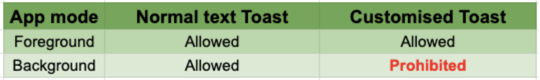
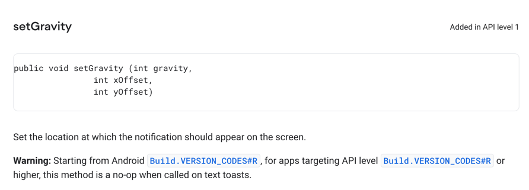
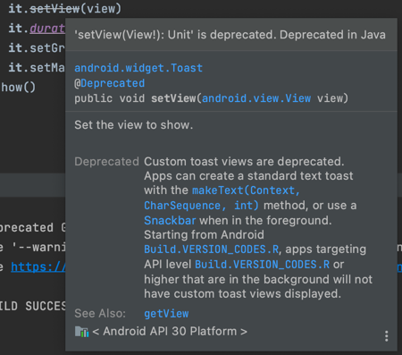

# 영어스터디 시즌 4 8주차

created by [juho](https://github.com/pachuho/Development-English-study) on 2021-12-19

https://itnext.io/android-11-toast-updates-7f1cd2245bc4
https://developer.android.com/reference/android/widget/Toast#setGravity(int,%20int,%20int)

# 📗 단어 정리 📘

### OBS BUILD
|영어|한글|
|---|---|
|no-op (no operation)|조종 불능의| 

------------------------------

# Android 11 Toast Updates
Android 11 (R) is the next generation of Android in 2020 and Google has released the Android 11 Preview 2.1 in early April for developer’s review.
`안드로이드 11은 안드로이드 2020의 다음 세대이며 구글은 개발리뷰에 4월초 안드로이드 프리뷰를 배포했습니다.`

There are a lot of changes and one of the changes catches my attention — New Toast behaviour and restrictions on customisation.
`많은 변화가 있으며 변화중 하나에 집중했습니다. 새로운 Toast의 움직임과 커스텀 제약에 대해.`

In Android 11 (R), Google implements the following changes on Toast and they will be discussed in details in this article:
`안드로이드 11에서 구글은 Toast 아래와 같은 변화들을 실시했습니다. 그리고 이번 아티클레선 세부사항을 토의할겁니다.`

1. Background customised Toast is prohibited (See the cover photo)
`백그라운드 커스텀 토스트는 제한됩니다.`

2. Customisation is not allowed at “text Toast”
`커스텀은 텍스트 토스트에서 허용되지 않습니다.`

3. Deprecated function — setView()
`setView() 함수는 디프리케이티드됩니다.`

4. Newly added callback — Toast.Callback
`새로운 콜백이 추가됩니다.`
   

### 1. Background customised Toast is prohibited (See the cover photo)
```
val customToast = Toast(this).also {
val view = LayoutInflater.from(context).inflate(R.layout.foo_custom_toast, null)
it.setView(view)
it.duration = Toast.LENGTH_LONG
it.setGravity(Gravity.START, 0, 0)
it.setMargin(0.1f, 0.2f)
}
```


Custom Toast CANNOT be shown when app is at the background. 
`커스텀 토스트는 백그라운드일 때 보여질 수 없습니다.`

A Toast with message “Background custom toast blocked for package [packageName] See g.co/dev/toast.” is shown instead.
`토스트는 보여지는 대신에 "백그라운드 커스텀은 해당 패키지에서 차단했습니다"라는 메세지가 나옵니다.`

### 2. Customisation is not allowed at “text Toast”
```
val customToast = Toast.makeText(this, "Custom Text Toast\n(Gravity + Margin)", Toast.LENGTH_SHORT).also {
it.setGravity(Gravity.START or Gravity.BOTTOM, 0, 0)
it.setMargin(0.1f, 0.06f)
it.show()
```

Before Android R, both simple Toast and text Toast can be customised with the margins and gravity with offsets. 
`안드로이드 R 이전에 간단한 토스트와 텍스트 토스트는 여백과 위치 오프셋으로 커스텀될 수 있었습니다.`

However, starting from Android R, text Toast can no longer be set with these parameters since the setter functions have become no-op functions,i.e.  
`하지만 안드로이드R부터는 텍스트 토스트는 세팅 함수가 허용되지 않기 때문에 더 이상 설정되지 않습니다.`

a function can be called but do nothing. See below for the screenshots of the setGravity official documentation.
`함수는 호출될 수 있지만 아무것도 할 수 없습니다. 하단 스크린샷 공식문서의 "setGravity"를 확인하세요.`


However, this new implementation is only applied to text Toast only. 
`그러나 이번 새로운 구현은 오직 텍스트 토스트에 적용됩니다.`

In other words, the simple Toast , which is constructed by Toast(context: Context) can still be customised with margins and gravity with offsets. See below for the illustration:
`요약하자면, Toast(context: Context)에 의해 만들어진 심플 토스트는 여전히 여백과 위치를 커스텀될 수 있습니다.`

###3. Deprecated function — setView()

Although it is still allowed to customise the Toast view by setView(view: View), 
`비록 토스트뷰에 setView를 커스텀하는 것이 허용되지만`
it is actually a deprecated function in Android R.
`안드로이드 R에선 이 함수는 사실 디프리케이티드 함수입니다.`

“Deprecated” means the function can still be used at the current moment but it is probably going to be removed in the future Android version. 
`"Deprecated"는 현재 시점에서 여전히 사용할 수 있지만 안드로이드 미래 버전에선 삭제될 것이라는걸 의미합니다.`

Developer is recommended to avoid using this function for long term development.
`개발자들은 오랜 개발 기간동안 그런 함수를 사용하는 것을 피할 걸 권장됩니다.`

### 4. Newly added callback — Toast.Callback
A new callback (Toast.Callback) is added to notify when Toast is shown and hidden. 
`토스트가 생기고 사라질 때를 알릴 수 있는 새로운 콜백이 추가됩니다.`
It can be added to a Toast easily by:
`다음과 같이 쉽게 토스트에 추가될 수 있습니다.`

```
val fooToast = Toast.makeText(this, "Simple toast message", Toast.LENGTH_SHORT)
fooToast.addCallback(object: Toast.Callback() {
  override fun onToastShown() {
    super.onToastShown()
    // Do you own stuff
  }

  override fun onToastHidden() {
    super.onToastHidden()
    // Do you own stuff
  }
})
fooToast.show()
```