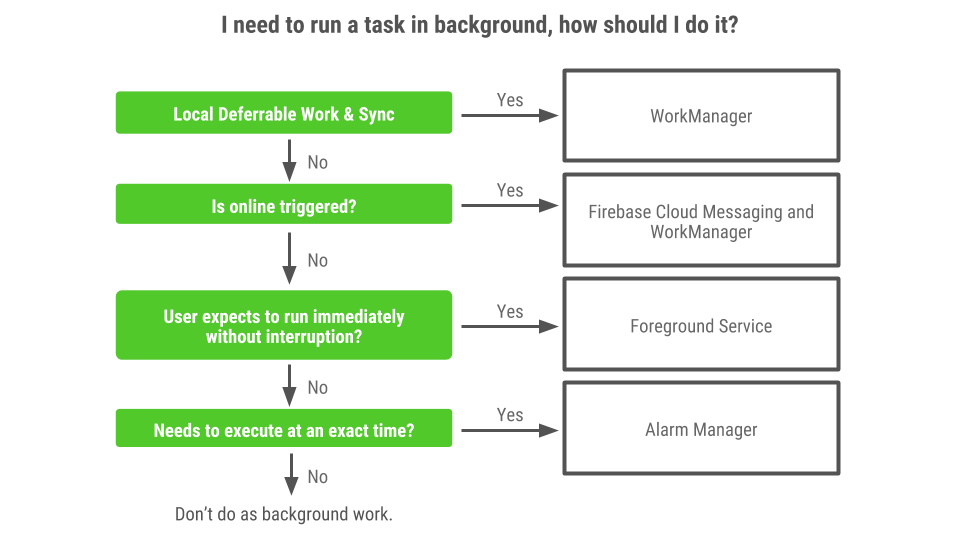
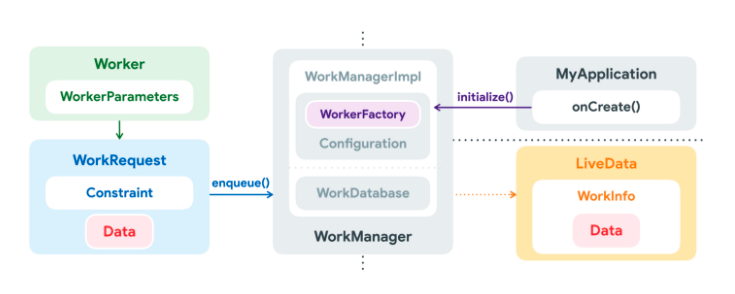

# 영어스터디 시즌 4 7주차

created by [juho](https://github.com/pachuho/Development-English-study) on 2021-12-05

#Android WorkManager

[영상](https://www.youtube.com/watch?v=_SQM-10TB4k)

# 📗 단어 정리 📘

### OBS BUILD
|영어|한글|
|---|---|
|evenly|고르게|
|deferrable|연기할 수 있는|

### Summary

- WorkManager 개요
- WorkManager의 주요 기능
- WorkManager의 구성 
- WorkManager의 사용 예시

------------------------------

## WorkManager 개요

- 앱이 종료되거나 기기가 다시 시작되어도 실행 예정인 지연 가능한 비동기 작업을 쉽게 예약할 수 있게 해준다.
- 안드로이드 백그라운드 작업을 처리하는 방법 중 하나로, Android Jetpack 아키텍처의 구성 요소 중 하나이다.
- 하나의 코드로 API Level 마다 비슷한 동작을 보장한다.

## WorkManager의 주요 기능

- API 14 이상 단말을 지원한다.
- 네트워크 가용성, 충전상태와 같은 작업의 제약 조건을 설정할 수 있다.
- 일회성 혹은 주기적인 비동기 작업을 예약할 수 있다.
- 예약된 작업 모니터링 관리를 할 수 있다.
- 앱이나 기기나 다시 시작되는 경우에도 작업 실행을 보장한다.
- 잠자기 모드와 같은 절전 기능을 지원한다.
- 지연 가능하고 안정적으로 실행되어야 하는 작업을 대상으로 설계되어 있다. (ex. 백엔드 서비스에 로그 또는 분석을 전송하는 작업, 주기적으로 데이터를 서버와 동기화하는 작업)

## WorkManager의 구성


### 1. WorkManager
- 처리해야 하는 작업을 자신의 큐에 넣고 관리한다.
- 싱글톤으로 구현되어 있어서 getInstance()로 WorkManager의 인스턴스를 받아 사용한다.
### 2. Worker
- 추상 클래스로 처리해야 하는 백그라운드 작업의 처리 코드를 이 클래스를 상속받아 doWork() 메소드를 오버라이드하여 작성한다.
- dowork()는 작업 결과에 따라 Result를 success, failure, retry 로 분기처리 해햐한다.
### 3. WorkRequest
- WorkManager를 통해 실제 요청하게 될 개별 작업이다.
- 처리해야 할 작업인 Work와 작업반복 여부 및 작업실행 조건, 제약사항 등 이 작업을 어떻게 처리할지에 대한 정보가 담겨있다.
- 반복 여부에 따라 onTimeWorkRequest, PeriodicWorkRequest로 나뉜다.
### 4. WorkState
- WorkRequest의 id와 해당 WorkRequest의 현재 상태를 담는 클래스
- ENQUEUED, RUNNING, SUCCEEDED, FAILED, BLOCKED, CANCELLED의 6개의 상태를 가진다.

## WorkManager의 사용 예시
### 1. 단순 작업
```
import androidx.work.Worker

class ExampleWorker : Worker() {
    override fun doWork(): Result {
        /* 처리해야할 작업에 관한 코드들 
       처리 결과에 따라 리턴 결과를 지정해준다.*/
        return Result.success()
    }
}
```
- Worker 클래스를 상속받은 클래스를 만들고 doWork() 메서드를 오버라이드 한다.
###
```
var workRequest = OneTimeWorkRequestBuilder<ExampleWorker>().build()
```
- OneTimeWorkRequestBuilder를 이용해서 OneTimeWorkRequest객체를 생성한다
###

```
var workRequest = OneTimeWorkRequestBuilder<ExampleWorker>().build()

val workManager = WorkManager.getInstance()

workManager?.enqueue(workRequest)
```
-  WorkManager 클래스의 인스턴스를 작업큐에 추가해준다.
###

```
val workReqeust = PeriodicWorkRequestBuilder<ExampleWorker>(15, TimeUnit.MINUTES).build()

val workManager = WorkManager.getInstance()

workManager?.enqueue(workRequest)
```
- 반복되는 작업은 PeriodWorkReqeustBuilder를 이용해준다.(반복시간에 사용할 수 있는 가장 짧은 최소값은 15이다.)
###
### 2. 제약 조건을 가지는 작업
```
val constraints = Constraints.Builder()
	/* 네트워크 연결상태에 대한 제약 조건 */
	.setRequiredNetworkType(NetworkType.CONNECTED)
	/* 충전 상태에 대한 제약 조건 */
	.setRequiresCharging(true)
	.build()

/* 제약조건과 함께 작업을 생성하거나 */
val requestConstraint = OneTimeWorkRequestBuilder<ExampleWorker>()
	.setConstraints(constraints)
	.build()

/* 작업을 생성하고 나중에 제약조건을 설정해 줄수 있다 */
workRequest.setConstraint(constraints)
```
- 제약 조건은 Constrains 클래스의 Builder를 이용해서 생성한 뒤 WorkRequest에 추가한다.
###
### 3. 연결된 작업
```
val workA = OneTimeWorkReqeustBuilder<AWorker>().build()
val workB = OneTimeWorkRequestBuider<BWorker>().build()

WorkManager.getInstance()?.apply {
    beginWith(workA).then(workB).enqueue()
}
```
- 두 작업을 연결해서 처리하기 위해서 beginWith()와 then()인자를 사용해 추가할 수 있다.
###
### 4. 작업 처리상태 파악
```
val workRequest = OneTimeWorkRequestBuilder<ExampleWorker>().build()

val workManager = WorkManager.getInstance()
workManager?.let {
    it.enqueue(workRequest)
    
    /** WorkManager의 getStatusById()에 WorkRequest의 UUID 객체를 인자로 전달 하면
     *  인자값으로 주어진 ID에 해당하는 작업을 추적할 수 있도록 LiveData 객체를 반환한다
   	 */
    val statusLiveData = it.getStatusById(workRequest.id)
    /* statusLiveData에 Observer를 걸어서 작업의 상태를 추적 */
    statusLiveData.observe(this, Observer { workState ->
        Log.d("exmaple", "state: ${workState?.state}")
    })
}
```
- LiveData를 통해 옵저빙 할 수 있다.
###
### 5. 작업 취소
```
/* cancelWork 작업을 WorkManager의 큐에 추가 */
WorkManager.getInstance()?.enqueue(cancelWork)

/* cancelWork의 id를 이용해서 작업을 취소 */
WorkManager.getInstnace()?.cancelWorkById(cancelWork.id)
```
- UUID를 이용해 작업을 취소 시킨다. 아래와 같이 태그를 이용해 작업을 취소할 수 있다.
```
val cancelWork = OnetimeRequestBuilder<CancelWorker>()
	.addTag("cancel work tag")

WorkManager.getInstnace()?.cancelWorkById("cancel work tag")
```
###
- 취소하려는 작업이 이미 완료된 작업이라면 취소 메서드는 아무 기능을 하지 않는다.
- 아직 실행 전 큐에 담긴 상태라면 실행하지 않고 취소된다.
- 이미 실행된 작업이라면 임의로 취소되지 않는다. 이를 해결하기 위해 아래와 같이 doWork()에 작업 취소 플래그를 설정해 줄 수 있다.
```
override fun doWork() : Result {
    if (isStopped) {
        /* 작업이 멈추었을 때 대비한 코드 */
        
        if (isCancelled) {
            /* 작업이 취소 되었을 때 대비한 코드 */
        }
    }
}
```

